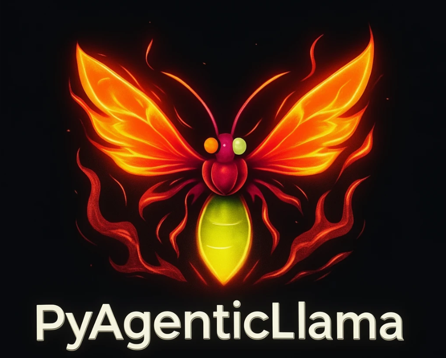

<div align="center">
  <a href="https://globalwarningnetworks.com/PyAgenticLlama/">
    
  </a>
  <h1>PyAgenticLlama</h1>
  <p><strong>Advanced local AI interface built on llama.cpp</strong> — streaming chat, agent orchestration, persistent memory, secure vault, skill system, and external API provider support.</p>
  <p><a href="https://globalwarningnetworks.com/PyAgenticLlama/">📖 Helper to create skills</a></p>
</div>

---

## Features

### Chat & Inference
- **Streaming chat** with real-time token/sec display
- **Collapsible thinking blocks** — models like Qwen3 that emit `<think>` tags show a collapsible reasoning panel
- **Stop generation** button — cancel mid-stream, keeps whatever arrived
- **Auto context compaction** — when context hits 80%, old messages are summarized automatically
- **Context bar** — live token usage with color indicator (green → yellow → red)

### AI Provider Support
- **Local llama.cpp** — fully private, no internet required
- **Manual API** — point to any OpenAI-compatible endpoint (NVIDIA NIM, Groq, Together AI, Mistral, etc.)
- **Upload config file** — drop a `.py` provider file (e.g. `nvidia_env.py`) and `base_url`, `api_key`, and `model` are extracted automatically
- Switch providers anytime via `/provider` or the 🔌 badge in the menu bar
- API keys stored encrypted in the vault — never in plaintext

### Code Blocks
- Every code fence renders with a **language badge**, **📋 Copy**, **▶ Run** (Python), **👁 Preview** (HTML/JS/CSS), and **⌗ VS Code** buttons
- **Run** executes Python locally and shows stdout/stderr inline
- **Preview** renders HTML/JS/CSS in a sandboxed iframe with console capture
- Raw model HTML is always safely escaped — no injection possible

### Models
- Load any `.gguf` model from `models/` **or anywhere on disk** via the filesystem browser
- **Hardware check on load** — reads GGUF metadata: architecture, layers, heads, context length, RAM estimate
- Correct KV-cache estimation using the GQA formula
- **Model Inspector** shows full architecture details

### Personalities
| Name | Use case | Temp |
|------|----------|------|
| 🤖 Assistant | General chat | 0.7 |
| 💻 Coder | Strict code formatting, separate files per block | 0.2 |
| ✨ Creative | Writing, storytelling | 1.1 |
| 📊 Analyst | Structured, factual, tabular responses | 0.3 |

Create unlimited custom personalities with avatar color, icon, system prompt, temperature, and top-p.

### Agent Mode
- **Agent loop** — AI calls skills as tools and loops up to 10 iterations autonomously
- **Sub-agent spawning** — dispatch tasks to a separate llama-server instance; results stream back to main chat
- Agent trace panel shows each tool call and output

### Skills (Tool System)
- **Python skills** — define `execute(**kwargs)`; access vault secrets with `vault_get("KEY")`
- **Webhook skills** — POST to any HTTP endpoint
- **Auto-discovery** — drop a `.py` file with `execute()` into `app/skills/` and it registers on next startup
- Built-in snippet libraries: Python, JavaScript, HTML/JS, SQL, Bash, Arduino
- Toggle skills on/off; enabled skills inject as tools into every request

### Brain / Memory
- Persistent memory in SQLite — facts, preferences, project notes
- Full-text recall search
- Conversation history saved per session, browsable in the History tab
- Toggle **🧠 Memory** mode to inject relevant context into every message

### Secure Vault
- API keys and env vars encrypted with **AES-256 (Fernet)**
- Key derived from machine identity — no master password, machine-locked
- Variables in `ALL_CAPS` auto-loaded into environment on startup
- Access inside skills: `vault_get("OPENAI_API_KEY")`

### UI
- **Splash screen** on load — logo + Unix green boot sequence, fades when ready
- App menu bar — File, Edit, View, Model, Settings, Tools, Agent, Help
- Dark theme, tabbed left/right panels, floating Console and Terminal windows
- Coding session mode (`/coding`) with VS Code integration for direct file delivery
- MCP server support for extended tool ecosystems

---

## VS Code Integration

Install the bundled extension to sync PyAgenticLlama with VS Code — send AI code directly into the editor and open the shared workspace folder in one click.

### Install

```
cd vscode-extension
install.bat
```

Then **restart VS Code**. The 🦙 PyAgenticLlama status bar item appears at the bottom right.

### Open the shared workspace folder (no file browsing needed)

1. Press `Ctrl+Shift+P`
2. Type **PyAgenticLlama: Open Shared Workspace Folder**
3. VS Code opens `workspace/` — the same folder PyAgenticLlama writes files to

Or click the **🦙 PyAgenticLlama** status bar item → **Open Workspace**.

The `workspace/` folder is the shared root. Files saved from the CodingSpace panel appear here instantly in VS Code's Explorer (no sync needed — it's the same directory on disk).

### CodingSpace (split-screen editor)

Type `/CodingSpace` in PyAgenticLlama to open a split layout:
- **Left** — chat with the AI
- **Right** — code editor + file tree for the `workspace/` folder

Every AI code block gets a **→ CS** button. Click it to load the code into the editor, give it a filename, hit **💾 Save**, then **📂 VS Code** to open the whole workspace — or **⌗ VS Code** to send just that file as a new tab.

---

## Requirements

- **Windows 10/11**
- **Python 3.10+**
- **llama.cpp binaries** — place in `llama_exec/` (Vulkan build recommended for AMD/Intel GPUs)
- At least one `.gguf` model (for local inference)

---

## Quick Start

```bash
# 1. Clone
git clone https://github.com/tattooinmtl/PyAgenticLlama.git
cd PyAgenticLlama

# 2. Add llama.cpp binaries
#    Copy llama-server.exe and its DLLs into llama_exec/

# 3. Add a model
#    Copy any .gguf file into models/

# 4. Launch
start-app.bat
```

Open **http://localhost:7860** in your browser.

> **External API only?** Skip steps 2 & 3 — load the app, run `/provider`, and configure your NVIDIA NIM / OpenAI / Groq key. No local model needed.

---

## Getting llama.cpp Binaries

Download a pre-built release from [llama.cpp releases](https://github.com/ggerganov/llama.cpp/releases).

| GPU | Build to download |
|-----|------------------|
| AMD (Vulkan) | `vulkan` build |
| NVIDIA (CUDA) | `cuda` build |
| CPU only | `win-noavx` or `avx2` build |

Extract all files (`llama-server.exe`, `*.dll`) into `llama_exec/`.

---

## GPU Layers

| Setting | Effect |
|---------|--------|
| `0` | CPU only — safe default |
| `1–10` | Light offload — integrated GPUs with 2–4 GB VRAM |
| `20–32` | Heavy offload — dedicated GPUs with 6+ GB VRAM |
| `99` | All layers on GPU — only if model fits entirely in VRAM |

---

## Recommended Models (32 GB RAM, CPU-only)

| Model | Size | Use case |
|-------|------|----------|
| Llama 3.1 8B Q4_K_M | 4.6 GB | General chat, coding |
| Qwen2.5 14B Q4_K_M | ~9 GB | Coding, reasoning |
| Qwen3 27B Q4_K_M | ~17 GB | Best quality |
| Mistral 22B Q4_K_M | ~14 GB | Fast reasoning |

---

## Project Structure

```
PyAgenticLlama/
├── app/
│   ├── main.py           # FastAPI backend — all routes
│   ├── logo.png          # App logo (used in splash screen)
│   ├── gguf.py           # GGUF metadata reader
│   ├── hardware.py       # RAM/VRAM detection
│   ├── llama.py          # llama-server process manager
│   ├── context.py        # Context tracking and compaction
│   ├── brain.py          # SQLite memory
│   ├── vault.py          # AES-256 encrypted secrets
│   ├── personalities.py  # Personality definitions
│   ├── mcp_client.py     # MCP server integration
│   ├── skills/           # Skill definitions (.json + .py)
│   └── static/
│       ├── index.html    # Single-page app
│       ├── style.css     # Dark theme
│       └── app.js        # All frontend logic (~2700 lines)
├── data/                 # Runtime data (gitignored)
│   ├── brain.db          # SQLite memory
│   └── vault.enc         # Encrypted secrets
├── llama_exec/           # llama.cpp binaries (add your own)
├── models/               # GGUF models (add your own)
├── requirements.txt
└── start-app.bat
```

---

## Key API Endpoints

| Method | Path | Description |
|--------|------|-------------|
| `POST` | `/api/server/start` | Load model + start llama-server |
| `POST` | `/api/chat` | Chat (streaming SSE) |
| `POST` | `/api/agent` | Agentic tool-calling loop |
| `GET/POST/DELETE` | `/api/provider` | Get/set/reset AI provider |
| `POST` | `/api/provider/parse-file` | Extract config from .py file |
| `GET`  | `/api/models` | List available GGUF files |
| `POST` | `/api/run` | Execute Python code |
| `POST` | `/api/brain/remember` | Store a memory |
| `GET`  | `/api/brain/recall?q=` | Search memories |
| `POST` | `/api/vault/set` | Store encrypted secret |
| `GET/POST` | `/api/skills` | List / create skills |
| `POST` | `/api/skills/{id}/run` | Execute a skill |

---

## License

MIT
